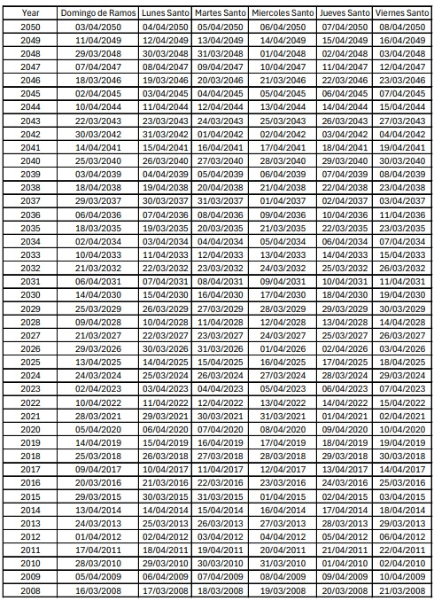

# pascuaRio: funciones para identificar las fechas de Semana Santa de 1997 a 2050 

## Resumen
pascuaRio es un paquete para R, que proporciona 3 funciones para:

* Indicar si una fecha pertece a la Semana Santa, desde el año 1997 hasta el año 2050. De esta forma, devuelve (TRUE/FALSE) si la fecha de un data frame corresponde a Semana Santa.
  * función: semana_santa()
    
* También indica a que año corresponde esa Semana Santa, ejemplo: la fecha "2025-04-13", es Semana Santa (2025), pero la fecha "2025-04-12" no es de Semana Santa, entonces es FALSE.
  * función: semana_santa_anio()
    
* Finalmente, indentifica qué día de la semana mayor es (Domingo de Ramos, Lunes Santo, etc.), ejemplo: la fecha "2025-04-13" es "Domingo de Ramos", pero la fecha "2025-04-12" no es de Semana Santa, entonces es NA.
  * función: semana_santa_dia() 
  
**Este paquete se creo con fines de análisis estadístico en contextos como estudios de capacidad hotelera, incidencia delictiva, emergencias prehospitalarias, emergencias urbanas, entre otros, siempre y cuando los eventos hayan ocurrido durante la Semana Santa.**

**Este paquete no fue creado con fines religiosos, sino como una herramienta para apoyar a los analistas de datos que en algún momento de su carrera deben de realizar estudios sobre información que haya ocurrido durante este periodo.**

El paquete considera únicamente el periodo que va desde el Domingo de Ramos hasta el Domingo de Resurrección de cada año, excluyendo otros días como el Miércoles de Ceniza. 

En la carpeta "data" se incluye el data frame con todas las fechas de la semana mayor desde 1997 hasta el 2050. 

Las fechas que se quieran analizar deben de estar en el formato ymd, por lo que se recomienda el uso de as.Date o del paquete lubridate.

## Instalación

En la consola de R, se deben de ejecutar las siguientes líneas:

```
install.packages("devtools")
library(devtools)
devtools::install_github("Eriana-129/pascuaRio")
library(pascuaRio)
```

## Origen del nombre "pascuaRio"

El nombre se compone de tres palabras:

* Pascua: en referencia al Viernes Santo.
* R: en referencia al software para el que fue creado, el poderosísimo R.
* Calendario: en alusión a que se trata de varios días y años los que se contemplan en este paquete.

## Razón de creación del paquete

En mis actividades laborales se me pidió analizar varios data sets de diferentes temas, pero todos en relación de la semana santa de años pasados a fin de realizar medidas de prevención para cuidar a la población. Dada la cantidad de bases de datos que tuve que analizar, así como la temporalidad de cada una que iba desde pocos años hasta lustros, se me ocurrió la idea de que quizás no era la única persona con el problema de tener que analizar el comportamiento de las personas en estas fechas, sobre todo en países hispanohablantes. Además, considerando que la Semana Santa no ocurre en una fecha establecida, esto representa un reto al momento de construir si quiera un data frame de todas las fechas de este periodo religioso. Por estas razones fue que decidí crear pascuaRio.

Finalmente, en caso de que el usuario solo quiera conservar el csv de todas las fechas de la Semana Santa desde 1997 a 2050, debe de ejecutar estas líneas de código en la consola de R:

```
library(data.table) #para csv
fwrite(pascuario, "./data.csv", encoding = "UTF-8")

library(openxlsx) #para excel
write.xlsx(pascuario, "./data.xlsx")
```

Ejemplo del data frame:



## Reporte de errores

En caso de encontrar algún problema al usar pascuaRio, favor de reportarlo en [GitHub](https://github.com/Eriana-129/pascuaRio/issues). La posibilidad de que pascuaRio solicite el paquete "data.table" es mínima, ya que que lo programe para que ese paquete se instale y cargue de forma automática.


